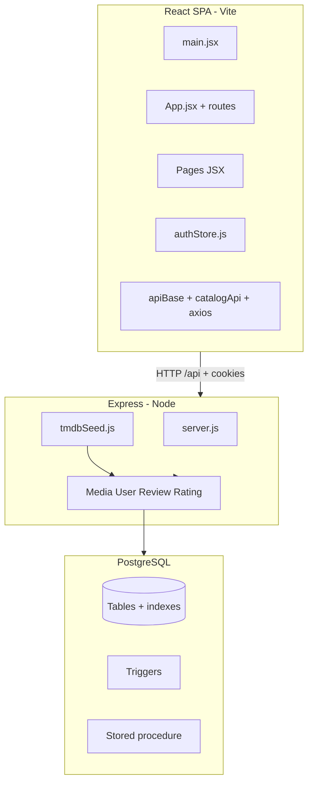

# Netflix-DBMS — Full Stack Documentation

This document describes the JavaScript modules, JSX UI layer, PostgreSQL database (queries, triggers, functions, procedures), authentication, and how the pieces connect.

---

## 1. High-level architecture

- **Frontend**: React 19 + React Router + Zustand + Tailwind + Swiper; calls REST under `/api` with `credentials` so JWT cookies work (same-origin via Vite proxy in dev).
- **Backend**: Single Express app (`server.js`) + `pg` pool; business logic split into **models** (`Media`, `User`, `Review`, `Rating`).
- **Database**: PostgreSQL schema in `backend/database/schema.sql` (+ `schema_update.sql` for awards); optional columns added at runtime via `ensureDynamicColumns()`.

---

## 2. JavaScript files (in depth)

### 2.1 Backend entry and HTTP layer

| File | Role |
|------|------|
| **`backend/server.js`** | Express app: CORS (credentials), JSON, `cookie-parser`, static `/uploads`, multer for profile/admin images. Defines **JWT** signing (`JWT_SECRET`), **`protectRoute`** (cookie → verify JWT → `User.findById` → ban check), **`adminRoute`** (JWT + `role === 'admin'`). Maps URL helpers (`catalogCard`, `toMovieDetail`, `toSeriesDetail`, `normalizeSeasonsForApi`). Registers all REST routes (catalog, auth, watchlist, media reviews/ratings, admin, Gemini AI). Production: serves `frontend/dist` + SPA fallback. |
| **`backend/config/loadEnv.js`** | Loads `backend/.env` via `dotenv` before DB and secrets are read. |
| **`backend/database/config/db.js`** | Creates `pg.Pool` from `DATABASE_URL`, exports `connectToDB()` smoke test and `pool`. |
| **`backend/database/index.js`** | Barrel export: `pool`, `connectToDB`, models, `ensureDynamicColumns`, `isUuid`. |

### 2.2 Database models (business logic + SQL)

| File | Role |
|------|------|
| **`backend/database/models/Media.js`** | UUID validation (`isUuid`). **Reads**: `findById` (movie join), `findSeriesById`, `findSummaryById`, `findByTmdbId`, `getGenresForMedia`, `listMovies` / `listSeries` (dynamic `WHERE`/`ORDER BY` by `section` + optional `EXISTS` genre filter), `searchCatalog`, `searchMovies`, `matchTitles` (per-title movie then series), `listRecommendations` / `listRecommendationsSeries` (shared genres + random filler), `listSeasonsWithEpisodesByMediaId`, `getRatingStatsByMediaId`, `listAllForAdmin`, admin URL/metadata updates, **create** movie/TV with transactions, **upsert** seasons/episodes, delete movie. |
| **`backend/database/models/User.js`** | Auth-shaped rows (`findByUsername`, `findById` with `_id` alias). Profile updates, verification/reset tokens, ban/unban (cannot target admins), `getAllUsers`, `deleteUser`. **Watchlist**: `getWatchlist` (join `Watchlist`→`Media`), `addToWatchlist`, `removeFromWatchlist`, `checkInWatchlist`. |
| **`backend/database/models/Review.js`** | `getReviewsForMedia` (join user), `createReview` (transaction + duplicate check), `voteOnReview` (upsert `ReviewVote`), admin list/delete. |
| **`backend/database/models/Rating.js`** | `rateMedia`: `INSERT ... ON CONFLICT DO UPDATE` on `Rating`; **trigger** on `Rating` refreshes `Media.rating` / `num_votes`. |

### 2.3 Migrations and seeding

| File | Role |
|------|------|
| **`backend/database/migrations/dynamicColumns.js`** | `ensureDynamicColumns()`: `ALTER TABLE ... ADD COLUMN IF NOT EXISTS` for email verification, reset OTP, ban fields, `Media.tmdb_id`, `tmdb_data`, `admin_metadata`. Called on server start and before sensitive routes. |
| **`backend/utils/tmdbSeed.js`** | If catalog empty and TMDB creds set: fetch popular movies/TV, call `Media.createMovie` / `Media.createTvSeries`, then **`seedTvSeasonsForMedia`** (per-season TMDB API → `upsertSeasonEpisodesForSeriesMedia`). Env: `TMDB_SEED_TV_SEASONS_MAX` (optional cap), delays, max counts. |
| **`backend/utils/dateOnly.js`** | `toDateOnlyString`: normalize `Date`/string for JSON (no time-of-day leak). |
| **`backend/utils/rotation.js`** | Logging helpers: redact emails, safe error strings. |
| **`backend/utils/mailer.js`** + **`emailTemplates.js`** | Nodemailer transport; signup + password-reset templates. |
| **`backend/utils/profanity.js`** | `containsProfanity` (word list + normalization); available if you wire it into review routes (currently not enforced in `server.js` for reviews). |

### 2.4 Frontend JavaScript (non-JSX)

| File | Role |
|------|------|
| **`frontend/src/main.jsx`** | `axios.defaults.withCredentials = true`; mounts React root with `BrowserRouter`. |
| **`frontend/src/lib/apiBase.js`** | **`API_URL`**: `VITE_API_URL` or **`/api`** (same-origin + Vite proxy). **`getSiteOrigin()`**: for `/uploads` URLs when API is relative. |
| **`frontend/src/lib/catalogApi.js`** | Axios wrappers: `fetchCatalogMovies/Series`, detail, recommendations, **`fetchSeriesSeasons`**, `searchCatalog`, `matchCatalogTitles`. |
| **`frontend/src/lib/mediaUrls.js`** | `resolveImageUrl` (TMDB path vs absolute URL), `catalogImageUrl` (cards), `youtubeKeyFromUrl`. |
| **`frontend/src/lib/dateDisplay.js`** | Human-readable date formatting for UI. |
| **`frontend/src/lib/AIModel.js`** | POST `/api/ai/recommendations` with credentials; normalizes Gemini fallback responses. |
| **`frontend/src/store/authStore.js`** | Zustand store: signup, login, logout, `fetchUser`, profile, watchlist add/remove, password reset flows; all axios calls use **`API_URL`** from `apiBase`. User payload normalized (e.g. profile pic URL). |
| **`frontend/vite.config.js`** | React + Tailwind; **dev proxy** `/api` and `/uploads` → `http://localhost:5000`. |
| **`frontend/eslint.config.js`** | ESLint flat config. |

### 2.5 Root / duplicate database config

| File | Role |
|------|------|
| **`database/config/db.js`** | Duplicate pool pattern (if used by standalone scripts); primary app uses **`backend/database/config/db.js`**. |

---

## 3. JSX files (short)

Pages are route targets; components are reused UI.

| File | Purpose |
|------|---------|
| **`App.jsx`** | `Routes`: `/`, `/browse/:tab`, `/movie/:id`, `/series/:id`, `/search`, auth, profile, watchlist, admin, AI, help; guards `Navigate` for unauthenticated users. |
| **`pages/Homepage.jsx`** | Hero + multiple `CardList` rows (movies + TV). |
| **`pages/Browse.jsx`** | Reads `tab` param; maps to `catalogType` + section/genre for `CardList`. |
| **`pages/Moviepage.jsx`** | Movie detail, trailer, watchlist, ratings, reviews, recommendations. |
| **`pages/Seriespage.jsx`** | Series detail, season dropdown, episodes (tooltips), ratings, reviews, recommendations. |
| **`pages/SearchResults.jsx`** | `searchCatalog` by query string. |
| **`pages/Watchlist.jsx`** | Lists saved titles from store/API. |
| **`pages/SignIn.jsx` / `SignUp.jsx` / `ForgotPassword.jsx`** | Auth forms. |
| **`pages/Profile.jsx`** | Profile edit. |
| **`pages/AIRecommendations.jsx`** | Mood/genre wizard → Gemini titles → `matchCatalogTitles`. |
| **`pages/AdminDashboard.jsx`** | Users, reviews, movie CRUD, custom media metadata. |
| **`pages/HelpCenter.jsx`** | Static help content. |
| **`components/Navbar.jsx`** | Nav + search suggestions (`searchCatalog`). |
| **`components/Hero.jsx`** | Landing hero. |
| **`components/CardList.jsx`** | Swiper carousel of movies or series from API. |
| **`components/RecommendedMovies.jsx`** | Used by **`AIRecommendations.jsx`**: maps AI title list to catalog matches. |
| **`components/Footer.jsx`** | Footer links. |

---

## 4. Database system

### 4.1 Entity model (core)

- **`Media`**: Canonical row for both movies and series (`media_type` check: `movie` \| `series`). Holds title, plot, dates, **aggregate** `rating` / `num_votes` (maintained by triggers from `Rating`), poster/backdrop/trailer, optional `tmdb_id`, `tmdb_data`, `admin_metadata`.
- **`Movie`**: 1:1 with `Media` (`media_id`); box office, budget, tagline, etc.
- **`TVSeries`**: 1:1 with `Media`; season/episode counts, dates, status.
- **`Season`**: Belongs to `TVSeries`; unique `(series_id, season_number)`.
- **`Episode`**: Belongs to `Season`; unique `(season_id, episode_number)`; optional per-episode rating/votes (schema supports; app may focus on Media-level ratings).
- **`Genre` / `MediaGenre`**: Many-to-many for classification.
- **`Person` / `Credit`**: Cast/crew (schema present; seed may not populate all).
- **`User`**: Accounts, `role` `user` \| `admin`, optional `password_hash` flows extended by dynamic columns.
- **`Rating`**: One row per `(user_id, media_id)`; values 1–10.
- **`Review`**: Text review per user per media (app enforces one review per user per media in code).
- **`ReviewVote`**: Like/dislike per user per review; triggers update `Review.likes` / `dislikes`.
- **`Watchlist`**: `(user_id, media_id)` composite PK.
- **`Award`** (`schema_update.sql`): Optional awards linked to media/person.

### 4.2 Indexes (from schema)

- `idx_media_type`, `idx_media_rating`, `idx_media_title` on `Media`
- `idx_rating_media` on `Rating(media_id)`
- `idx_review_media` on `Review(media_id)`
- `idx_award_media` on `Award(media_id)` (if applied)

### 4.3 Functions and triggers

| Name | Type | Purpose |
|------|------|---------|
| **`update_updated_at_column()`** | `RETURNS TRIGGER` (plpgsql) | Sets `NEW.updated_at = NOW()` on `Media` updates. |
| **`update_media_modtime`** | `BEFORE UPDATE ON Media` | Executes `update_updated_at_column`. |
| **`update_media_rating()`** | `RETURNS TRIGGER` (plpgsql) | After `INSERT/UPDATE/DELETE` on **`Rating`**: recomputes `AVG(rating_value)` and `COUNT(*)` for that `media_id`, writes `Media.rating` and `Media.num_votes`. |
| **`trg_update_media_rating`** | `AFTER INSERT OR UPDATE OR DELETE ON Rating` | Executes `update_media_rating`. |
| **`update_review_votes()`** | `RETURNS TRIGGER` (plpgsql) | After changes on **`ReviewVote`**: increments/decrements `Review.likes` / `Review.dislikes`; handles vote **type changes** (like↔dislike). |
| **`trg_update_review_votes`** | `AFTER INSERT OR UPDATE OR DELETE ON ReviewVote` | Executes `update_review_votes`. |

**Note:** Older PostgreSQL uses `EXECUTE PROCEDURE` in `schema.sql`; newer versions prefer `EXECUTE FUNCTION` for triggers—adjust if your PG version requires it.

### 4.4 Stored procedure

| Name | Purpose |
|------|---------|
| **`create_user_review(p_user_id, p_media_id, p_content, p_rating)`** | Checks duplicate review; validates optional rating 1–10; inserts into `Review`. The **Node app** currently uses **`Review.createReview`** in JS instead of calling this procedure, but the procedure documents the intended business rule in the database. |

### 4.5 Complex / representative SQL patterns (from models)

1. **Genre-filtered catalog** (movies or series): `WHERE` + `EXISTS (SELECT 1 FROM MediaGenre mg JOIN Genre gn ... gn.name ILIKE $n)` plus section-specific predicates (e.g. upcoming: `release_date > CURRENT_DATE`).
2. **Search catalog**: `title ILIKE` or `plot_summary ILIKE`, and `EXISTS` to ensure row is a real movie or series via `Movie` / `TVSeries` join.
3. **Recommendations (movies)**: `MediaGenre` self-join to find other titles sharing genres, ordered by `num_votes`; if not enough rows, **`ORDER BY RANDOM()`** filler (same for series variant with `TVSeries` join).
4. **Seasons + episodes tree**: `TVSeries` → `Season` → `LEFT JOIN Episode`, ordered by season and episode numbers; grouped in JS for API responses.
5. **Watchlist**: `Watchlist JOIN Media` ordered by `added_at DESC`.
6. **User rating upsert**: `INSERT INTO Rating ... ON CONFLICT (user_id, media_id) DO UPDATE SET rating_value = EXCLUDED.rating_value` — triggers keep `Media` aggregates in sync.

---

## 5. Authentication (application layer)

| Mechanism | Details |
|-----------|---------|
| **Password storage** | bcrypt hashes (`bcryptjs`) on signup and password reset. |
| **Session** | **JWT** in **httpOnly** cookie named `token` (not localStorage). `jwt.sign({ id: user_id }, JWT_SECRET, { expiresIn: '7d' })`. |
| **Protected routes** | `protectRoute`: reads `req.cookies.token`, `jwt.verify`, loads user, checks ban (with optional auto-lift if `banned_until` expired). Attaches `req.user`. |
| **Admin routes** | `adminRoute`: same as protect + `user.role === 'admin'`. |
| **Email verification** | Signup stores OTP + expiry; user must verify before login (login checks `is_verified`). |
| **Ban model** | `is_banned`, `banned_until` (epoch ms); `403` with message if active. |

**CORS**: Reflects request `Origin` with `credentials: true` so cross-origin dev can work; **recommended dev setup** is relative **`/api`** so the SPA and API share the browser origin (Vite proxy).

---

## 6. How it fits together (request flows)

### 6.1 Catalog browse

1. User opens **Homepage** / **Browse** → `CardList` calls **`fetchCatalogMovies`** or **`fetchCatalogSeries`** (`/api/catalog/movies|series?section=...&genre=...`).
2. Express → **`Media.listMovies`** / **`Media.listSeries`** → SQL with filters → JSON cards → UI.

### 6.2 Title detail

1. **`/movie/:id`** → `fetchMovieDetail` → `Media.findById` + genres.
2. **`/series/:id`** → `fetchSeriesDetail` + `fetchSeriesRecommendations` + **`fetchSeriesSeasons`** → `findSeriesById` + `listSeasonsWithEpisodesByMediaId`.

### 6.3 Reviews and ratings

1. **GET** `/api/media/:mediaId/reviews` → public list.
2. **POST** review → **`protectRoute`** → `Review.createReview` (transaction; duplicate check).
3. **POST** `/api/reviews/:reviewId/vote` → upsert **`ReviewVote`** → **trigger** updates like/dislike counts.
4. **POST** `/api/media/:mediaId/ratings` → **`Rating.rateMedia`** → **trigger** updates **`Media`** aggregate rating.

### 6.4 Auth + watchlist

1. Login sets cookie; **`fetch-user`** restores session on refresh.
2. Watchlist mutations call **`User.addToWatchlist`** / **`removeFromWatchlist`**; list uses join query to return `Media` fields for UI cards.

### 6.5 Admin + TMDB bootstrap

1. Admin routes use **`adminRoute`** + role check in DB updates (`banUser` cannot ban another admin).
2. Server start: **`ensureDynamicColumns`**, **`seedCatalogFromTmdbIfEmpty`** may populate empty `Movie`/`TVSeries`/`Season`/`Episode` from TMDB.

---

## 7. File location quick reference

| Area | Path |
|------|------|
| Express API | `backend/server.js` |
| PG models | `backend/database/models/*.js` |
| Pool / env | `backend/database/config/db.js`, `backend/config/loadEnv.js` |
| SQL DDL | `backend/database/schema.sql`, `backend/database/schema_update.sql` |
| Runtime DDL | `backend/database/migrations/dynamicColumns.js` |
| TMDB seed | `backend/utils/tmdbSeed.js` |
| React app | `frontend/src/App.jsx`, `frontend/src/pages/*.jsx`, `frontend/src/components/*.jsx` |
| Client API helpers | `frontend/src/lib/*.js`, `frontend/src/store/authStore.js` |

---

*Generated for the Netflix-DBMS project. Adjust if you add routes, tables, or change auth behavior.*
