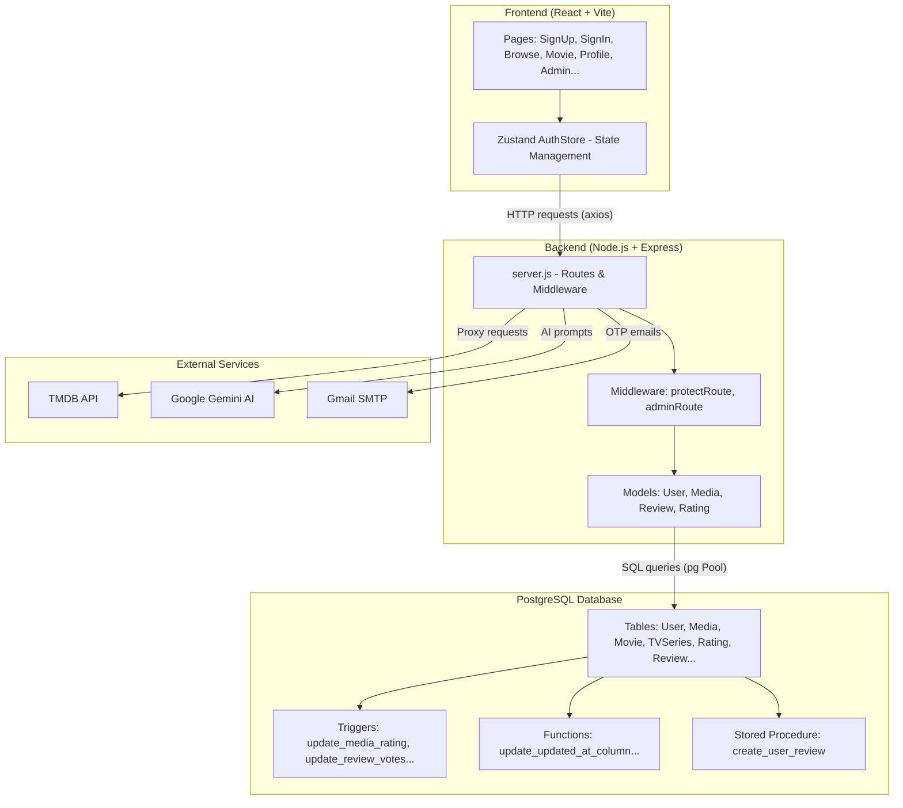
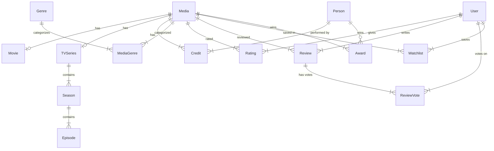
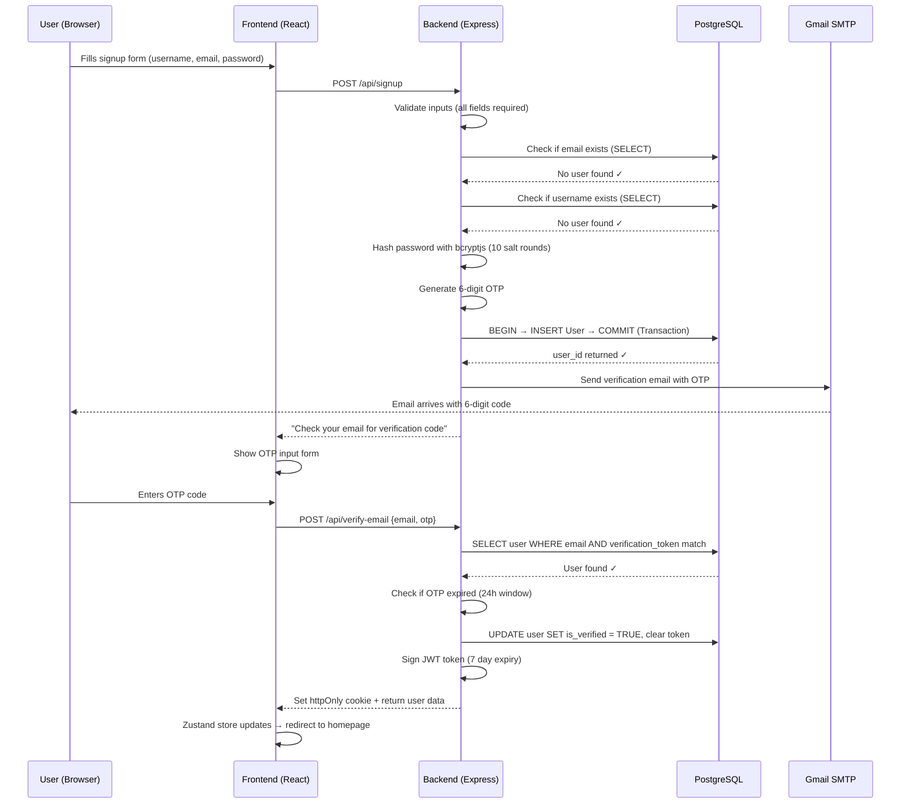
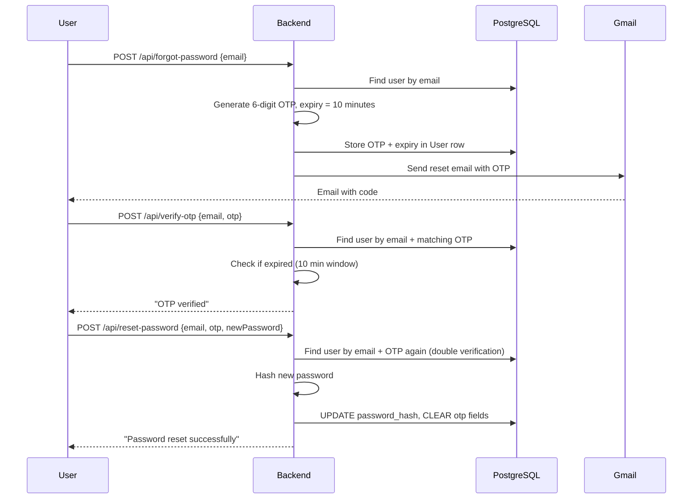

# 🎬 Netflix-DBMS — Complete Presentation Guide

> **Purpose**: This guide walks you through every aspect of your project so you can confidently explain it in a presentation. Database concepts (authentication, transactions, functions, procedures, triggers, indexes, constraints) are covered in extreme detail with exact code references from your project.

---

## Table of Contents

1. [Project Overview — The Big Picture](#1-project-overview)
2. [System Architecture — How Everything Connects](#2-system-architecture)
3. [Database Schema Design (ER Model)](#3-database-schema-design)
4. [PostgreSQL Core Concepts in YOUR Project](#4-postgresql-core-concepts)
   - 4.1 [Data Types & Constraints](#41-data-types--constraints)
   - 4.2 [PRIMARY KEY, FOREIGN KEY, UNIQUE, CHECK](#42-primary-key-foreign-key-unique-check)
   - 4.3 [Indexes](#43-indexes)
   - 4.4 [Functions (PL/pgSQL)](#44-functions-plpgsql)
   - 4.5 [Triggers](#45-triggers)
   - 4.6 [Stored Procedures](#46-stored-procedures)
   - 4.7 [Transactions (BEGIN/COMMIT/ROLLBACK)](#47-transactions-begincommitrollback)
5. [Authentication System — Full Deep Dive](#5-authentication-system)
6. [Authorization & Role-Based Access (RBAC)](#6-authorization--rbac)
7. [CRUD Operations — How Data Flows](#7-crud-operations)
8. [API Endpoints Summary](#8-api-endpoints-summary)
9. [Frontend Architecture](#9-frontend-architecture)
10. [Security Practices](#10-security-practices)
11. [Potential Viva/Presentation Q&A](#11-potential-presentation-qa)

---

## 1. Project Overview

**What is this project?**
A full-stack Netflix clone with a **PostgreSQL** relational database backend. It allows users to:
- Browse movies and TV shows (data fetched from TMDB API)
- Sign up / Log in with email verification (OTP based)
- Rate movies (1–10 scale)
- Write & vote on reviews (like/dislike)
- Manage a personal watchlist
- Get AI-powered movie recommendations (Google Gemini)
- Admin panel to manage users, reviews, and media metadata

**Tech Stack:**

| Layer | Technology |
|-------|-----------|
| **Database** | PostgreSQL (with `uuid-ossp` extension) |
| **Backend** | Node.js + Express.js |
| **Frontend** | React (Vite) + Zustand (state management) |
| **External APIs** | TMDB (movie data), Google Gemini (AI recommendations) |
| **Auth** | JWT (JSON Web Tokens) + bcryptjs (password hashing) |
| **Email** | Nodemailer (Gmail SMTP) |

---

## 2. System Architecture



**How a request flows:**
1. User interacts with React frontend
2. Frontend sends HTTP request via axios (with cookies for auth)
3. Express middleware checks JWT token → verifies user
4. Backend model executes SQL query against PostgreSQL
5. Database triggers fire automatically if data changes
6. Response flows back to frontend → UI updates via Zustand store

---

## 3. Database Schema Design

### Entity-Relationship Diagram



### All Tables at a Glance

| Table | Purpose | Key Fields |
|-------|---------|-----------|
| **Media** | Central content table (movies + series) | `media_id` (UUID PK), `title`, `media_type`, `rating`, `num_votes` |
| **Movie** | Movie-specific data | `movie_id` (PK), `media_id` (FK → Media), `box_office_worldwide` |
| **TVSeries** | Series-specific data | `series_id` (PK), `media_id` (FK → Media), `total_seasons`, `status` |
| **Season** | Season within a series | `season_id` (PK), `series_id` (FK → TVSeries), `season_number` |
| **Episode** | Episode within a season | `episode_id` (PK), `season_id` (FK → Season), `episode_number` |
| **Person** | Actors, directors, writers | `person_id` (PK), `full_name`, `biography` |
| **Credit** | Junction: Person ↔ Media | `credit_id` (PK), `media_id` (FK), `person_id` (FK), `role_type` |
| **Genre** | Movie genres | `genre_id` (PK), `name` (UNIQUE) |
| **MediaGenre** | Junction: Media ↔ Genre | Composite PK (`media_id`, `genre_id`) |
| **User** | User accounts | `user_id` (UUID PK), `username` (UNIQUE), `email` (UNIQUE), `password_hash`, `role` |
| **Rating** | User ratings (1–10) | `rating_id` (PK), `user_id` (FK), `media_id` (FK), `rating_value` |
| **Review** | User text reviews | `review_id` (PK), `user_id` (FK), `media_id` (FK), `content`, `likes`, `dislikes` |
| **ReviewVote** | Like/dislike on reviews | `vote_id` (PK), `user_id` (FK), `review_id` (FK), `vote_type` |
| **Watchlist** | User's saved movies | Composite PK (`user_id`, `media_id`) |
| **Award** | Awards for media/person | `award_id` (PK), `media_id` (FK), `person_id` (FK), `name`, `is_winner` |

> **Design Pattern**: This is a **Table Inheritance** pattern. `Media` is the "parent" and `Movie`/`TVSeries` are "children" connected via FK. This avoids NULLs in the base table.

---

## 4. PostgreSQL Core Concepts

> [!IMPORTANT]
> This is the most presentation-critical section. Every concept below is demonstrated with ACTUAL code from your project.

### 4.1 Data Types & Constraints

Your project uses these PostgreSQL data types:

| Data Type | Where Used | Example |
|-----------|-----------|---------|
| `UUID` | All primary keys | `media_id UUID PRIMARY KEY DEFAULT uuid_generate_v4()` |
| `VARCHAR(n)` | Strings with max length | `title VARCHAR(500) NOT NULL` |
| `TEXT` | Unlimited-length strings | `plot_summary TEXT` |
| `INT` | Integers | `release_year INT` |
| `BIGINT` | Large integers | `num_votes BIGINT DEFAULT 0` |
| `DECIMAL(p,s)` | Precise decimals | `rating DECIMAL(3,1)` — allows values like `8.5` |
| `BOOLEAN` | True/false flags | `contains_spoiler BOOLEAN DEFAULT FALSE` |
| `DATE` | Dates | `birth_date DATE` |
| `TIMESTAMP` | Date + time | `created_at TIMESTAMP DEFAULT CURRENT_TIMESTAMP` |
| `CHAR(2)` | Fixed-length string | `country_code CHAR(2)` |
| `JSONB` | Binary JSON storage | `tmdb_data JSONB` — stores entire TMDB API responses |

**Why UUID instead of auto-increment?**
- UUIDs are globally unique — no collisions even across distributed systems
- Harder to guess (security benefit — users can't enumerate IDs)
- Generated via PostgreSQL extension: `CREATE EXTENSION IF NOT EXISTS "uuid-ossp";`

---

### 4.2 PRIMARY KEY, FOREIGN KEY, UNIQUE, CHECK

#### PRIMARY KEY
Every table has a UUID primary key:
```sql
CREATE TABLE Media (
    media_id UUID PRIMARY KEY DEFAULT uuid_generate_v4(),
    ...
);
```
**What to say**: "The primary key uniquely identifies each row. We use UUID v4 which generates random 128-bit identifiers, avoiding sequential ID guessing attacks."

#### FOREIGN KEY (with ON DELETE CASCADE)
```sql
CREATE TABLE Movie (
    movie_id UUID PRIMARY KEY DEFAULT uuid_generate_v4(),
    media_id UUID NOT NULL UNIQUE REFERENCES Media(media_id) ON DELETE CASCADE,
    ...
);
```
**What to say**: "`REFERENCES Media(media_id)` ensures referential integrity — you can't create a Movie without a corresponding Media row. `ON DELETE CASCADE` means if the parent Media is deleted, the Movie row is automatically deleted too — no orphan data."

#### Composite PRIMARY KEY (Junction Tables)
```sql
CREATE TABLE MediaGenre (
    media_id UUID NOT NULL REFERENCES Media(media_id) ON DELETE CASCADE,
    genre_id UUID NOT NULL REFERENCES Genre(genre_id) ON DELETE CASCADE,
    PRIMARY KEY (media_id, genre_id)  -- Composite key
);
```
**What to say**: "A composite primary key uses two columns together as the unique identifier. This naturally prevents duplicate entries — a movie can't be assigned the same genre twice."

#### UNIQUE Constraints
```sql
CREATE TABLE "User" (
    username VARCHAR(50) NOT NULL UNIQUE,  -- No two users can have same username
    email VARCHAR(255) NOT NULL UNIQUE,    -- No two users can have same email
    ...
);
```
Also used for logical uniqueness:
```sql
CREATE TABLE Rating (
    ...
    UNIQUE(user_id, media_id)  -- A user can only rate a movie ONCE
);
```

#### CHECK Constraints
```sql
rating DECIMAL(3,1) CHECK (rating >= 0 AND rating <= 10)     -- Rating must be 0-10
media_type VARCHAR(20) CHECK (media_type IN ('movie', 'series'))  -- Only these values allowed
role VARCHAR(20) DEFAULT 'user' CHECK (role IN ('user', 'admin'))  -- Role enum
status VARCHAR(20) CHECK (status IN ('ongoing', 'ended', 'canceled'))
vote_type VARCHAR(10) CHECK (vote_type IN ('like', 'dislike'))
gender VARCHAR(20) CHECK (gender IN ('male', 'female', 'other', 'undisclosed'))
```
**What to say**: "CHECK constraints enforce business rules at the database level. Even if the application code has a bug, the database will REJECT invalid data. This is called **defense in depth**."

---

### 4.3 Indexes

Your project defines these indexes in [schema.sql](file:///e:/C%20and%20C++/Buet/SQL/Project/Netflix-DBMS/backend/database/schema.sql#L294-L299):

```sql
CREATE INDEX idx_media_type   ON Media(media_type);   -- Fast filter: movies vs series
CREATE INDEX idx_media_rating  ON Media(rating);       -- Fast sort by rating
CREATE INDEX idx_media_title   ON Media(title);        -- Fast search by title
CREATE INDEX idx_rating_media  ON Rating(media_id);    -- Fast lookup: all ratings for a movie
CREATE INDEX idx_review_media  ON Review(media_id);    -- Fast lookup: all reviews for a movie
CREATE INDEX idx_award_media   ON Award(media_id);     -- Fast lookup: awards for a movie
```

**What to say**: 
> "An index is like the index at the back of a textbook. Without it, PostgreSQL must scan every row (Sequential Scan) to find matches. With an index, it uses a B-tree data structure to jump directly to matching rows. 
> 
> For example, `idx_media_type` speeds up queries like `SELECT * FROM Media WHERE media_type = 'movie'` — instead of scanning all 10,000 rows, it immediately finds only movie rows.
> 
> Trade-off: Indexes speed up reads but slow down writes (inserts/updates) because the index must be updated too. We only index columns that are frequently searched or filtered."

---

### 4.4 Functions (PL/pgSQL)

Your project has **3 PL/pgSQL functions**. These are server-side functions that PostgreSQL executes internally.

#### Function 1: `update_updated_at_column()`
**File**: [schema.sql:178-184](file:///e:/C%20and%20C++/Buet/SQL/Project/Netflix-DBMS/backend/database/schema.sql#L178-L184)

```sql
CREATE OR REPLACE FUNCTION update_updated_at_column()
RETURNS TRIGGER AS $$
BEGIN
    NEW.updated_at = NOW();
    RETURN NEW;
END;
$$ language 'plpgsql';
```

**What to say**:
> "This function is called **before** any update on the Media table. `NEW` is a special variable representing the row being updated. We set `NEW.updated_at` to the current timestamp, so every time media data changes, we automatically track when. `RETURN NEW` tells PostgreSQL to proceed with the modified row."

#### Function 2: `update_media_rating()`
**File**: [schema.sql:192-209](file:///e:/C%20and%20C++/Buet/SQL/Project/Netflix-DBMS/backend/database/schema.sql#L192-L209)

```sql
CREATE OR REPLACE FUNCTION update_media_rating()
RETURNS TRIGGER AS $$
DECLARE
    new_rating DECIMAL(3,1);
    new_votes BIGINT;
BEGIN
    SELECT AVG(rating_value), COUNT(*) INTO new_rating, new_votes
    FROM Rating
    WHERE media_id = COALESCE(NEW.media_id, OLD.media_id);
    
    UPDATE Media
    SET rating = COALESCE(new_rating, 0),
        num_votes = COALESCE(new_votes, 0)
    WHERE media_id = COALESCE(NEW.media_id, OLD.media_id);
    
    RETURN NEW;
END;
$$ language 'plpgsql';
```

**What to say**:
> "This is the most important function. When ANY user rates a movie (INSERT, UPDATE, or DELETE on the Rating table), this function:
> 1. **DECLARE**s two local variables: `new_rating` and `new_votes`
> 2. Uses `SELECT ... INTO` to calculate the **average** of all ratings and the **count** of total votes for that movie
> 3. `COALESCE(NEW.media_id, OLD.media_id)` handles all cases — INSERT uses `NEW` row, DELETE uses `OLD` row (the deleted row)
> 4. Updates the `Media` table's `rating` and `num_votes` columns with the freshly calculated values
> 
> This means the `rating` on the Media table is **always accurate** — it's a **derived/calculated field** maintained by the database itself, not by application code."

#### Function 3: `update_review_votes()`
**File**: [schema.sql:217-243](file:///e:/C%20and%20C++/Buet/SQL/Project/Netflix-DBMS/backend/database/schema.sql#L217-L243)

```sql
CREATE OR REPLACE FUNCTION update_review_votes()
RETURNS TRIGGER AS $$
BEGIN
    IF (TG_OP = 'INSERT') THEN
        IF (NEW.vote_type = 'like') THEN
            UPDATE Review SET likes = likes + 1 WHERE review_id = NEW.review_id;
        ELSIF (NEW.vote_type = 'dislike') THEN
            UPDATE Review SET dislikes = dislikes + 1 WHERE review_id = NEW.review_id;
        END IF;
    ELSIF (TG_OP = 'DELETE') THEN
        IF (OLD.vote_type = 'like') THEN
            UPDATE Review SET likes = likes - 1 WHERE review_id = OLD.review_id;
        ELSIF (OLD.vote_type = 'dislike') THEN
            UPDATE Review SET dislikes = dislikes - 1 WHERE review_id = OLD.review_id;
        END IF;
    ELSIF (TG_OP = 'UPDATE') THEN
        IF (OLD.vote_type != NEW.vote_type) THEN
            IF (NEW.vote_type = 'like') THEN
                UPDATE Review SET likes = likes + 1, dislikes = dislikes - 1 WHERE review_id = NEW.review_id;
            ELSIF (NEW.vote_type = 'dislike') THEN
                UPDATE Review SET dislikes = dislikes + 1, likes = likes - 1 WHERE review_id = NEW.review_id;
            END IF;
        END IF;
    END IF;
    RETURN NULL;
END;
$$ language 'plpgsql';
```

**What to say**:
> "This function uses `TG_OP` (Trigger Operation) to detect what happened on the `ReviewVote` table:
> - **INSERT**: A new vote → increment the appropriate counter (`likes +1` or `dislikes +1`)
> - **DELETE**: Vote removed → decrement the counter
> - **UPDATE**: User changed their vote (like → dislike or vice versa) → swap both counters simultaneously  
> 
> This keeps the `likes` and `dislikes` counts on the `Review` table **mathematically exact** at all times. The application never directly modifies these counts — it only inserts/updates/deletes votes, and the trigger handles the math.
>
> `RETURN NULL` because this is an AFTER trigger — we don't need to modify the triggering row itself."

---

### 4.5 Triggers

Triggers are the **event hooks** that call the functions above:

```sql
-- Trigger 1: Auto-update timestamps
CREATE TRIGGER update_media_modtime
    BEFORE UPDATE ON Media
    FOR EACH ROW
    EXECUTE PROCEDURE update_updated_at_column();

-- Trigger 2: Auto-recalculate ratings
CREATE TRIGGER trg_update_media_rating
    AFTER INSERT OR UPDATE OR DELETE ON Rating
    FOR EACH ROW
    EXECUTE PROCEDURE update_media_rating();

-- Trigger 3: Auto-update review vote counts
CREATE TRIGGER trg_update_review_votes
    AFTER INSERT OR UPDATE OR DELETE ON ReviewVote
    FOR EACH ROW
    EXECUTE PROCEDURE update_review_votes();
```

**Key concepts to explain**:

| Property | Trigger 1 | Trigger 2 | Trigger 3 |
|----------|-----------|-----------|-----------|
| **Timing** | `BEFORE` UPDATE | `AFTER` INSERT/UPDATE/DELETE | `AFTER` INSERT/UPDATE/DELETE |
| **Table** | Media | Rating | ReviewVote |
| **Granularity** | `FOR EACH ROW` | `FOR EACH ROW` | `FOR EACH ROW` |
| **Function** | `update_updated_at_column()` | `update_media_rating()` | `update_review_votes()` |

**What to say**:
> "**BEFORE** triggers fire before the change is committed — useful for modifying the row being changed (like setting `updated_at`). 
> 
> **AFTER** triggers fire after the change is committed — useful for side effects on OTHER tables (like updating the Media rating after a Rating is inserted).
> 
> **FOR EACH ROW** means the trigger fires once per affected row. If you insert 5 ratings, the trigger fires 5 times."

---

### 4.6 Stored Procedures

**File**: [schema.sql:254-289](file:///e:/C%20and%20C++/Buet/SQL/Project/Netflix-DBMS/backend/database/schema.sql#L254-L289)

```sql
CREATE OR REPLACE PROCEDURE create_user_review(
    p_user_id UUID,
    p_media_id UUID,
    p_content TEXT,
    p_rating INT DEFAULT NULL
)
LANGUAGE plpgsql
AS $$
DECLARE
    review_count INT;
BEGIN
    -- Check if user already reviewed this media
    SELECT COUNT(*) INTO review_count
    FROM Review
    WHERE user_id = p_user_id AND media_id = p_media_id;

    IF review_count > 0 THEN
        RAISE EXCEPTION 'User has already reviewed this media';
    END IF;

    -- Validate rating if provided
    IF p_rating IS NOT NULL AND (p_rating < 1 OR p_rating > 10) THEN
        RAISE EXCEPTION 'Rating must be between 1 and 10';
    END IF;

    -- Insert the review
    INSERT INTO Review (user_id, media_id, content, rating)
    VALUES (p_user_id, p_media_id, p_content, p_rating);
END;
$$;
```

> [!IMPORTANT]
> **Function vs Procedure — Know the difference!**
> 
> | Feature | Function | Procedure |
> |---------|----------|-----------|
> | **RETURNS** | Must return a value (`RETURNS TRIGGER`, `RETURNS INT`, etc.) | Does NOT return a value |
> | **Called with** | `SELECT my_function()` | `CALL my_procedure()` |
> | **Transaction control** | Cannot `COMMIT`/`ROLLBACK` inside | CAN contain `COMMIT`/`ROLLBACK` |
> | **Use case** | Computing values, trigger handlers | Multi-step business operations |

**What to say**:
> "This stored procedure encapsulates business logic inside the database. It:
> 1. Accepts parameters with the `p_` prefix (naming convention for procedure parameters)
> 2. Checks if the user already reviewed this movie — `RAISE EXCEPTION` aborts the procedure and sends an error back
> 3. Validates the rating range
> 4. Only inserts the review if all checks pass
>
> The benefit is that this validation logic lives **inside the database** — even if someone bypasses our Node.js server and runs SQL directly, the rules are still enforced."

---

### 4.7 Transactions (BEGIN/COMMIT/ROLLBACK)

This is heavily used throughout your backend models. Transactions ensure **ACID properties**.

#### What is ACID?

| Property | Meaning | Your Project Example |
|----------|---------|---------------------|
| **Atomicity** | All operations succeed or ALL fail | User creation: if INSERT fails, nothing is committed |
| **Consistency** | Database always moves from valid state to valid state | CHECK constraints + triggers ensure valid data |
| **Isolation** | Concurrent transactions don't interfere | PostgreSQL's default isolation level handles this |
| **Durability** | Once committed, data survives crashes | PostgreSQL writes to disk on COMMIT |

#### Transaction in User Creation
**File**: [User.js:37-54](file:///e:/C%20and%20C++/Buet/SQL/Project/Netflix-DBMS/backend/database/models/User.js#L37-L54)

```javascript
static async create(userData) {
    const client = await pool.connect();   // Get a dedicated connection
    try {
        await client.query('BEGIN');       // Start transaction
        const { rows } = await client.query(
            'INSERT INTO "User" (...) VALUES ($1, $2, ...) RETURNING user_id',
            [username, email, passwordHash, ...]
        );
        await client.query('COMMIT');      // Success → save permanently
        return rows[0];
    } catch (error) {
        await client.query('ROLLBACK');    // Error → undo everything
        throw error;
    } finally {
        client.release();                  // Always return connection to pool
    }
}
```

#### Transaction in Profile Update (Multiple Queries)
**File**: [User.js:56-85](file:///e:/C%20and%20C++/Buet/SQL/Project/Netflix-DBMS/backend/database/models/User.js#L56-L85)

```javascript
static async updateProfile(userId, updates) {
    const client = await pool.connect();
    try {
        await client.query('BEGIN');
        if (username) await client.query('UPDATE "User" SET username = $1 WHERE user_id = $2', ...);
        if (email)    await client.query('UPDATE "User" SET email = $1 WHERE user_id = $2', ...);
        if (passwordHash) await client.query('UPDATE "User" SET password_hash = $1 WHERE user_id = $2', ...);
        // ... more updates
        await client.query('COMMIT');     // ALL updates saved atomically
    } catch (error) {
        await client.query('ROLLBACK');   // ANY failure → ALL updates reverted
        throw error;
    } finally {
        client.release();
    }
}
```

**What to say**:
> "In the profile update, we potentially run 5 separate UPDATE queries. Without a transaction, if the 3rd query fails, the first 2 would already be saved — leaving the data in an inconsistent state (e.g., username changed but email not). 
> 
> With `BEGIN...COMMIT`, either ALL 5 updates succeed, or NONE of them do. This is the **Atomicity** property of ACID."

#### Transaction in Watchlist Add (Check-then-Insert)
**File**: [User.js:150-168](file:///e:/C%20and%20C++/Buet/SQL/Project/Netflix-DBMS/backend/database/models/User.js#L150-L168)

```javascript
static async addToWatchlist(userId, mediaId) {
    const client = await pool.connect();
    try {
        await client.query('BEGIN');
        // Step 1: Check if already exists
        const { rowCount } = await client.query(
            'SELECT * FROM Watchlist WHERE user_id = $1 AND media_id = $2', [userId, mediaId]
        );
        if (rowCount > 0) {
            await client.query('ROLLBACK');
            return false;  // Already in watchlist
        }
        // Step 2: Insert
        await client.query('INSERT INTO Watchlist ...', [userId, mediaId]);
        await client.query('COMMIT');
        return true;
    } catch (error) {
        await client.query('ROLLBACK');
        throw error;
    } finally {
        client.release();
    }
}
```

**What to say**:
> "This is a classic **check-then-act** pattern wrapped in a transaction. Without a transaction, two simultaneous requests could both pass the check (finding 0 rows) and both try to insert — causing a duplicate. The transaction ensures these two steps are **atomic** — no other query can see the in-between state."

#### Transaction in Review Creation
**File**: [Review.js:13-33](file:///e:/C%20and%20C++/Buet/SQL/Project/Netflix-DBMS/backend/database/models/Review.js#L13-L33)

```javascript
static async createReview(userId, mediaId, content) {
    const client = await pool.connect();
    try {
        await client.query('BEGIN');
        // Check if user already reviewed
        const { rows } = await client.query(
            'SELECT COUNT(*) as count FROM Review WHERE user_id = $1 AND media_id = $2', ...
        );
        if (parseInt(rows[0].count) > 0) {
            await client.query('ROLLBACK');
            throw new Error('User has already reviewed this media');
        }
        await client.query('INSERT INTO Review ...', [userId, mediaId, content]);
        await client.query('COMMIT');
    } catch (error) {
        await client.query('ROLLBACK');
        throw error;
    } finally {
        client.release();
    }
}
```

#### Transaction in Rating (with UPSERT)
**File**: [Rating.js:4-19](file:///e:/C%20and%20C++/Buet/SQL/Project/Netflix-DBMS/backend/database/models/Rating.js#L4-L19)

```javascript
static async rateMedia(userId, mediaId, ratingValue) {
    const client = await pool.connect();
    try {
        await client.query('BEGIN');
        await client.query(`
            INSERT INTO Rating (user_id, media_id, rating_value) VALUES ($1, $2, $3)
            ON CONFLICT (user_id, media_id) DO UPDATE SET rating_value = EXCLUDED.rating_value
        `, [userId, mediaId, ratingValue]);
        await client.query('COMMIT');
    } catch (error) {
        await client.query('ROLLBACK');
        throw error;
    } finally {
        client.release();
    }
}
```

**What to say**:
> "`ON CONFLICT ... DO UPDATE` is PostgreSQL's **UPSERT** (insert or update). If the user hasn't rated this movie, it INSERTs. If they already have (violating the `UNIQUE(user_id, media_id)` constraint), it UPDATEs their existing rating instead. `EXCLUDED.rating_value` refers to the value that was attempted to be inserted. This is all wrapped in a transaction for safety."

---

## 5. Authentication System

This is a multi-step flow. Here's the complete picture:

### 5.1 Sign Up Flow



### 5.2 Password Hashing (bcryptjs)

```javascript
// During signup (server.js:277)
const hashedPassword = await bcryptjs.hash(password, 10);
// '10' is the salt rounds — bcrypt generates a random salt and hashes 2^10 = 1024 times

// During login (server.js:376)
bcryptjs.compareSync(password, user.password_hash)
// compareSync extracts the salt from the stored hash and re-hashes the input password
// Then compares the two hashes — NEVER compares plain text passwords
```

**What to say**:
> "We NEVER store plain-text passwords. `bcryptjs.hash(password, 10)` generates a random **salt** (random string) and hashes the password 2^10 = 1024 times. The result looks like `$2a$10$N9qo8uLOickgx2ZMRZoMye...`. 
>
> During login, `compareSync` extracts the salt from the stored hash, re-hashes the input password with the same salt, and compares. This is a one-way function — you **cannot** reverse a bcrypt hash back to the original password."

### 5.3 JWT Authentication

```javascript
// Creating a token (server.js:385)
const token = jwt.sign({ id: user._id }, JWT_SECRET, { expiresIn: "7d" });

// Setting as httpOnly cookie (server.js:386-390)
res.cookie("token", token, {
    httpOnly: true,       // JavaScript CANNOT access this cookie (XSS protection)
    secure: process.env.NODE_ENV === "production",  // HTTPS only in production
    sameSite: process.env.NODE_ENV === "production" ? "none" : "lax",
});

// Verifying on every protected request (server.js:147-163)
const protectRoute = async (req, res, next) => {
    const token = req.cookies.token;                    // Read from cookie
    if (!token) return res.status(401);                 // No token = not logged in
    const decoded = jwt.verify(token, JWT_SECRET);      // Verify signature
    const user = await User.findById(decoded.id);       // Load user from DB
    req.user = user;                                    // Attach to request
    next();                                             // Allow the request to proceed
};
```

**What to say**:
> "JWT (JSON Web Token) has 3 parts separated by dots: `header.payload.signature`. The payload contains `{ id: user_id }`. The signature is created using our `JWT_SECRET` — only our server can create or verify valid tokens.
>
> We store the token in an **httpOnly cookie** — this means JavaScript on the page CANNOT read it (preventing XSS attacks from stealing tokens). The browser automatically sends it with every request."

### 5.4 Login Flow

```javascript
// server.js:370-399
app.post("/api/login", async (req, res) => {
    const { username, password } = req.body;
    const user = await User.findByUsername(username);    // 1. Find user in DB
    
    if (!user || !bcryptjs.compareSync(password, user.password_hash)) {
        return res.status(400).json({ message: "Invalid credentials." });
        // Same error for both wrong username AND wrong password (security best practice)
    }
    
    if (user.is_banned) return res.status(403);         // 2. Check ban status
    if (user.is_verified === false) return res.status(403); // 3. Check email verified
    
    await User.updateLastLogin(user._id);               // 4. Record login time
    
    const token = jwt.sign({ id: user._id }, JWT_SECRET, { expiresIn: "7d" });
    res.cookie("token", token, { httpOnly: true, ... }); // 5. Set cookie
    
    delete user.password_hash;                          // 6. Remove hash before sending
    res.status(200).json({ user, message: "Logged in" });
});
```

### 5.5 Password Reset Flow



---

## 6. Authorization & RBAC

Your project implements **Role-Based Access Control** with two roles: `user` and `admin`.

### The `adminRoute` Middleware
**File**: [server.js:165-178](file:///e:/C%20and%20C++/Buet/SQL/Project/Netflix-DBMS/backend/server.js#L165-L178)

```javascript
const adminRoute = async (req, res, next) => {
    const token = req.cookies.token;
    const decoded = jwt.verify(token, JWT_SECRET);
    const user = await User.findById(decoded.id);
    if (!user || user.role !== 'admin') {
        return res.status(403).json({ message: "Admin access required" });
    }
    next();
};
```

### Admin Capabilities

| Endpoint | What it does |
|----------|-------------|
| `GET /api/admin/users` | List all users with ban/verify status |
| `PATCH /api/admin/users/:userId/ban` | Ban user (temporary or permanent) |
| `DELETE /api/admin/users/:userId` | Delete user account entirely |
| `GET /api/admin/reviews` | View all reviews system-wide |
| `DELETE /api/admin/reviews/:reviewId` | Remove inappropriate reviews |
| `PUT /api/admin/media/:tmdbId/custom` | Customize media metadata (poster, trailer, awards) |

### Ban System
The ban system supports **temporary** and **permanent** bans:
```javascript
// Temporary ban: banned_until = timestamp in the future
// Permanent ban: banned_until = null (never expires)
// Auto-lift: liftExpiredBanIfNeeded() checks on every auth request
```

### Frontend Route Protection
```jsx
// App.jsx — routes are protected based on user state
<Route path="/admin" element={
    user?.role === 'admin' ? <AdminDashboard /> : <Navigate to="/" />
} />
<Route path="/profile" element={
    user ? <Profile /> : <Navigate to="/signin" />
} />
```

---

## 7. CRUD Operations

### CREATE (INSERT)
```sql
-- User creation (via Node.js model with parameterized query)
INSERT INTO "User" (username, email, password_hash, role, verification_token, verification_expires, is_verified)
VALUES ($1, $2, $3, $4, $5, $6, $7) RETURNING user_id

-- Media stub creation
INSERT INTO Media (title, poster_url, backdrop_url, release_date, rating, num_votes, tmdb_id, tmdb_data, media_type)
VALUES ($1, $2, $3, $4, $5, $6, $7, $8, $9) RETURNING media_id
```

### READ (SELECT)
```sql
-- Find user by username (with column aliasing)
SELECT user_id AS _id, username, email, password_hash, role, is_verified,
       profile_picture AS "profilePic"
FROM "User" WHERE username = $1

-- Get reviews with JOIN
SELECT r.review_id, r.content, r.likes, r.dislikes, r.posted_at,
       u.username, u.profile_picture
FROM Review r JOIN "User" u ON r.user_id = u.user_id
WHERE r.media_id = $1 ORDER BY r.posted_at DESC

-- Get watchlist with JOIN
SELECT m.tmdb_data FROM Watchlist w
JOIN Media m ON w.media_id = m.media_id
WHERE w.user_id = $1
```

### UPDATE
```sql
-- Update profile fields individually
UPDATE "User" SET username = $1 WHERE user_id = $2
UPDATE "User" SET email = $1 WHERE user_id = $2

-- UPSERT rating (INSERT or UPDATE)
INSERT INTO Rating (user_id, media_id, rating_value) VALUES ($1, $2, $3)
ON CONFLICT (user_id, media_id) DO UPDATE SET rating_value = EXCLUDED.rating_value

-- UPSERT review vote
INSERT INTO ReviewVote (user_id, review_id, vote_type) VALUES ($1, $2, $3)
ON CONFLICT (user_id, review_id) DO UPDATE SET vote_type = EXCLUDED.vote_type

-- Merge JSONB metadata
UPDATE Media SET admin_metadata = COALESCE(admin_metadata, '{}'::jsonb) || $1::jsonb
WHERE media_id = $2
```

### DELETE
```sql
DELETE FROM "User" WHERE user_id = $1
DELETE FROM Review WHERE review_id = $1
DELETE FROM Watchlist WHERE user_id = $1 AND media_id = $2
```

---

## 8. API Endpoints Summary

### Authentication
| Method | Endpoint | Auth | Description |
|--------|----------|------|-------------|
| POST | `/api/signup` | — | Register new user |
| POST | `/api/verify-email` | — | Verify email with OTP |
| POST | `/api/resend-verification` | — | Resend verification OTP |
| POST | `/api/login` | — | Login with credentials |
| POST | `/api/logout` | — | Clear JWT cookie |
| GET | `/api/fetch-user` | Cookie | Get current user data |
| POST | `/api/forgot-password` | — | Start password reset |
| POST | `/api/verify-otp` | — | Verify reset OTP |
| POST | `/api/reset-password` | — | Set new password |

### User Actions
| Method | Endpoint | Auth | Description |
|--------|----------|------|-------------|
| PUT | `/api/update-profile` | `protectRoute` | Update profile fields |
| POST | `/api/upload-profile-pic` | `protectRoute` | Upload profile picture |
| GET | `/api/watchlist` | `protectRoute` | Get user's watchlist |
| POST | `/api/watchlist/add` | `protectRoute` | Add movie to watchlist |
| DELETE | `/api/watchlist/remove/:id` | `protectRoute` | Remove from watchlist |
| POST | `/api/media/:id/reviews` | `protectRoute` | Post a review |
| POST | `/api/reviews/:id/vote` | `protectRoute` | Like/dislike a review |
| POST | `/api/media/:id/ratings` | `protectRoute` | Rate a movie |
| POST | `/api/ai/recommendations` | `protectRoute` | Get AI recommendations |

### Admin
| Method | Endpoint | Auth | Description |
|--------|----------|------|-------------|
| GET | `/api/admin/users` | `adminRoute` | List all users |
| PATCH | `/api/admin/users/:id/ban` | `adminRoute` | Ban/unban user |
| DELETE | `/api/admin/users/:id` | `adminRoute` | Delete user |
| GET | `/api/admin/reviews` | `adminRoute` | List all reviews |
| DELETE | `/api/admin/reviews/:id` | `adminRoute` | Delete review |
| PUT | `/api/admin/media/:id/custom` | `adminRoute` | Edit media metadata |

---

## 9. Frontend Architecture

### State Management (Zustand)
All auth-related state lives in [authStore.js](file:///e:/C%20and%20C++/Buet/SQL/Project/Netflix-DBMS/frontend/src/store/authStore.js):

```javascript
// Central state
user: null,         // Current logged-in user object (or null)
isLoading: false,   // Show loading spinners
error: null,        // Display error messages
fetchingUser: true,  // Initial load state

// Actions: signup, login, logout, fetchUser, updateProfile,
//          uploadProfilePic, addToWatchlist, removeFromWatchlist, etc.
```

### Page Structure
| Page | Auth Required | Purpose |
|------|:---:|---------|
| Homepage | No | Landing page with hero + browse |
| Browse | No | Browse movies/series by category |
| SearchResults | No | Search TMDB |
| Moviepage | No | Movie details, reviews, ratings |
| SignIn / SignUp | No (redirects if logged in) | Authentication |
| ForgotPassword | No | Password reset flow |
| Profile | Yes | Edit profile, upload picture |
| Watchlist | Yes | View saved movies |
| AIRecommendations | Yes | AI-powered movie suggestions |
| HelpCenter | Yes | FAQ / Support |
| AdminDashboard | Admin only | User/review/media management |

---

## 10. Security Practices

| Practice | Implementation | File |
|----------|---------------|------|
| **Password hashing** | bcryptjs with 10 salt rounds | server.js:277 |
| **httpOnly cookies** | JWT stored in cookie, JS can't access | server.js:386-390 |
| **Parameterized queries** | All queries use `$1, $2...` placeholders | All model files |
| **Input validation** | CHECK constraints in DB + server-side checks | schema.sql + server.js |
| **Log sanitization** | Credentials redacted from logs | rotation.js |
| **CORS configuration** | Credentials-aware CORS | server.js:50-58 |
| **Path traversal protection** | TMDB proxy validates paths | server.js:71-77 |
| **Role-based access** | `adminRoute` middleware | server.js:165-178 |
| **Ban auto-expiry** | Checked on every request | server.js:131-140 |

> [!WARNING]
> **SQL Injection Prevention**: Your project uses **parameterized queries** (also called "prepared statements"). Instead of string concatenation like `"SELECT * FROM User WHERE id = '" + userId + "'"` (DANGEROUS!), you use `pool.query('SELECT * FROM "User" WHERE user_id = $1', [userId])`. PostgreSQL treats `$1` as a **value**, not as SQL code — making injection impossible.

---

## 11. Potential Presentation Q&A

### Database Questions

**Q: Why PostgreSQL instead of MongoDB?**
> "PostgreSQL enforces strict relational integrity through foreign keys, constraints, triggers and transactions. For a media platform with complex relationships (users ↔ ratings ↔ reviews ↔ media ↔ genres ↔ people), a relational database prevents data inconsistencies. MongoDB's flexible schema would require application-level validation for things PostgreSQL handles automatically."

**Q: What is a trigger and why did you use it?**
> "A trigger is an automatic database function that fires when a specific event occurs (INSERT, UPDATE, DELETE). We use 3 triggers: one auto-updates timestamps, one recalculates average ratings when any user rates a movie, and one maintains like/dislike counters on reviews. The advantage is that this logic lives in the database — it works correctly even if you access the database from a different application."

**Q: What's the difference between a function and a procedure?**
> "A function returns a value and can be used in SELECT statements. A procedure doesn't return a value and can manage transactions internally. Our functions return TRIGGER type and are called by triggers. Our procedure `create_user_review` performs business logic (validation + insert) as a single callable unit."

**Q: Why use transactions?**
> "Transactions guarantee ACID properties. In our watchlist add operation, we check if the movie exists and then insert it — without a transaction, two simultaneous requests could both pass the check and cause a duplicate. With `BEGIN...COMMIT`, the check-and-insert is atomic."

**Q: What are indexes and why did you use them?**
> "Indexes are B-tree data structures that speed up searches on specific columns. Without `idx_media_title`, searching for a movie by title scans all rows (O(n)). With the index, it's O(log n). We indexed columns that appear in WHERE clauses and JOIN conditions."

**Q: Explain ON CONFLICT (UPSERT).**
> "UPSERT = INSERT or UPDATE. When a user rates a movie that they already rated, instead of failing due to the UNIQUE constraint, `ON CONFLICT (user_id, media_id) DO UPDATE` silently updates the existing rating. This makes the API idempotent."

### Architecture Questions

**Q: How does authentication work?**
> "Signup hashes the password with bcrypt, stores the hash, and sends a verification OTP via email. Login compares the input against the hash, checks verification and ban status, then issues a JWT in an httpOnly cookie. Every subsequent request is authenticated by the `protectRoute` middleware which verifies the JWT."

**Q: How is the connection pool used?**
> "The `pg.Pool` maintains a pool of reusable database connections. Instead of opening a new connection for every query (slow), we borrow one from the pool, use it, and return it. For transactions, we use `pool.connect()` to get a dedicated client that we release in the `finally` block."

**Q: What is `ensureDynamicColumns()` for?**
> "It's a migration system. Instead of dropping and recreating the database when we add new features (like banning, email verification), we use `ALTER TABLE ADD COLUMN IF NOT EXISTS` to safely add columns at runtime. This is non-destructive — existing data is preserved."

---

> [!TIP]
> **Final Presentation Tip**: When presenting, always follow this pattern:
> 1. **State the concept** ("This is a trigger")
> 2. **Show the code** (switch to schema.sql)
> 3. **Explain what it does** ("It fires after a rating is inserted...")
> 4. **Explain WHY** ("...so the average rating on the Media table is always accurate without requiring application code to maintain it")
